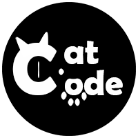

    
    <h3>
        - 😺 CatCode 2 😺 -
    </h3>
    
        <a href="https://github.com/ForteScarlet/CatCode2" target="_blank">github</a>
     
    &nbsp;&nbsp; | &nbsp;&nbsp;
    
        <a href="https://gitee.com/ForteScarlet/CatCode2" target="_blank">gitee</a>
      
    <small> &gt; 感谢 <a href="https://github.com/ForteScarlet/simpler-robot" target="_blank">Simple Robot</a> 开发团队成员制作的猫猫logo &lt; </small>  
    &gt; 如果有点击一下⭐的话，猫猫会很开心哦~ &lt;  
    
    
    

*****

    <h3>
        猫猫码（Cat code），一个可爱的通用特殊码，CQ码的精神延续。
    </h3>

   

猫猫码是一个具有特定格式的字符串格式编码，它看上去是这个样子的 👉 `[CAT:xxx,param1=value1,param2=value2]`

- 以`[`开头，`]`结尾。
- 首先是猫猫码的头标识(大小写数字或下划线，标准应为`CAT`)
- 头标识后是猫猫码的类型(大小写数字或下划线)，与头标识之间使用冒号`:`分割。
- 参数为多个key不重复的键值对，一对参数使用`=`连接键与值，多对参数使用`,`分割。
- 可以没有参数。
- 区分大小写。

### **猫猫是严格的。**

为了避免混淆整个存在猫猫码的文本中不允许出现：`[`、`]`、`&`
字符和制表符与换行符，猫猫码文本内中除了上述字符外，还不允许出现`,`与`=`字符。
因此，猫猫码的转义规则为：

- `&`  ->  `&amp;`
- `[`  ->  `&#91;`
- `]`  ->  `&#93;`
- `,`  ->  `&#44;`
- `=`  ->  `&#61;`
- `\n` ->  `&#13;`
- `\r` ->  `&#10;`
- `\t` ->  `&#09;`

### **猫猫是包容的。**

任何符合规则 `[HEAD:type,param=value,param=value,...]` 的特殊码均可以视为猫猫码，尽管 `HEAD` 可能并不是 `CAT`。

### **猫猫是无处不在的。**

**CatCode2** 核心库基于 [**Kotlin Multiplatform**](https://kotlinlang.org/docs/multiplatform.html) 支持多平台（JVM、JS、Native），
并且 **CatCode2** 提供了基于 [**kotlinx-serialization**](https://github.com/Kotlin/kotlinx.serialization) 的多平台序列化模块支持，
你可以借助 **kotlinx-serialization** 来自定义结构来描述你的猫猫码、序列化/反序列化你的猫猫码。

## 应用

### [核心库](catcode2-core)

[核心库](catcode2-core) 提供了针对猫猫码字符串的解析、读写与封装的核心基础功能，是最主要也是最基本的模块。

前往 [核心库模块](catcode2-core) 获取更多信息。

### [序列化库](catcode2-serialization)

**CatCode2** 提供了一些允许通过实体类作为载体来对猫猫码进行描述的模块，
例如对 [**kotlinx-serialization**](https://github.com/Kotlin/kotlinx.serialization) 的实现。

前往 [序列化模块](catcode2-serialization) 获取更多信息。

